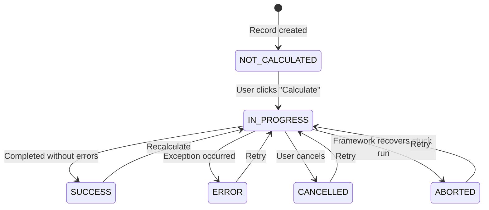

A `CalculationModel` is a model whose records can be "calculated" on demand. When a user clicks **Calculate** in the frontend, the framework transitions the record to `IN_PROGRESS`, kicks off your `calculate()` method, and then moves the record to the right terminal state for the outcome. The record can stay in progress while the work finishes — users don't need to keep the request open themselves. You only write the business logic — everything else is handled for you.

## Defining a Calculation Model

Inherit from `CalculationModel` and implement `calculate()`:

```python title="CalculateNAV.py"
from lex.core.models.CalculationModel import CalculationModel
from django.db import models


class CalculateNAV(CalculationModel):
    quarter = models.ForeignKey('Quarter', on_delete=models.CASCADE)
    nav_value = models.DecimalField(max_digits=19, decimal_places=2, null=True)

    def calculate(self):
        investments = Investment.objects.filter(quarter=self.quarter)
        total = sum(inv.market_value for inv in investments)
        self.nav_value = total
```

That's it. No decorators, no manual `self.save()`, no recursion guards. The framework handles state management, error capture, and saving automatically.

## The State Machine

The `is_calculated` field is a state machine with clear transitions:



| State | Meaning |
|---|---|
| `NOT_CALCULATED` | Record exists, no calculation run yet |
| `IN_PROGRESS` | Calculation is currently running |
| `SUCCESS` | Completed without errors |
| `ERROR` | An exception occurred (details stored in `calculation_error_message`) |
| `CANCELLED` | A user stopped a running calculation |
| `ABORTED` | The framework recovered a calculation that got stuck in progress |

If you're using Celery workers, cancelling is immediate: the framework revokes the running worker task and marks the record as `CANCELLED`. `ABORTED` is different — it's used when the framework finds an old `IN_PROGRESS` row that never finished cleanly, for example after a worker or app process died. Those terminal status updates are saved as normal model changes, so they show up in History/Timeline just like in-process runs.

## What You Get Automatically

You don't need to define or manage any of the following — they're inherited from `CalculationModel`:

- **`is_calculated`** — the state field
- **Recursion guard** — prevents re-entrant calculation loops
- **Error capture** — exceptions are caught and stored in `calculation_error_message`
- **Auto-save** — the record is saved automatically after `calculate()` returns
- **Non-blocking trigger** — clicking **Calculate** returns the record in `IN_PROGRESS`, then the UI updates again when the run finishes
- **Cancellation handling** — running Celery-backed calculations can be stopped cleanly from the UI/API
- **[[features/processing/celery and async calculations|Celery support]]** — dispatch to [Celery](https://docs.celeryq.dev/) workers for parallel execution
- **System-save attribution** — any records you save inside `calculate()` won't have their `edited_by` / `edited_at` stamped with the triggering user; those saves are treated as system-triggered, not direct user edits

> [!tip] Need to generate many records at once?
> If your calculation creates one output per combination (e.g., one liability per award per upload), see [[features/processing/batch calculations|Batch Calculations]] — `CalculatedModelMixin` handles the combination generation, deduplication, and parallel dispatch for you.

> [!info]- How the state machine works internally
> The `CalculationModel` base class uses `@hook(AFTER_UPDATE)` on the `is_calculated` field. When it transitions to `IN_PROGRESS`, the framework calls `calculate_hook()` which:
>
> 1. Sets `is_calculated = IN_PROGRESS`
> 2. Decides whether to hand the work to Celery or run it in-process (`should_use_celery()`)
> 3. Calls your `calculate()` method
> 4. On success: sets `is_calculated = SUCCESS` and saves
> 5. On cancellation: sets `is_calculated = CANCELLED`
> 6. On other exceptions: sets `is_calculated = ERROR`, stores the traceback in `calculation_error_message`, and saves
>
> You never need to manage this yourself.

## Another Example

```python title="CalculateBalanceSheet.py"
class CalculateBalanceSheet(CalculationModel):
    quarter = models.ForeignKey('Quarter', on_delete=models.CASCADE)
    total_assets = models.DecimalField(max_digits=19, decimal_places=2, null=True)

    def calculate(self):
        assets = Asset.objects.filter(quarter=self.quarter)
        self.total_assets = assets.aggregate(Sum('value'))['value__sum']
```

> [!note]- Migrating from V1?
> If you're coming from `ConditionalUpdateMixin`, here's what changes:
>
> | Aspect | V1 (Old) | Current |
> |---|---|---|
> | Base class | `ConditionalUpdateMixin` | `CalculationModel` |
> | Method name | `update()` | `calculate()` |
> | Decorator | `@ConditionalUpdateMixin.conditional_calculation` | Not needed |
> | State field | Boolean `is_calculated` | Enum with 6 states |
> | Recursion guard | Manual `dont_update` flag | Automatic |
> | Error handling | Manual `try/catch` | Automatic (stored in `calculation_error_message`) |
> | Save | Manual `self.save()` | Automatic after method returns |
>
> ### Migration Checklist
>
> - [ ] Change base class: `ConditionalUpdateMixin` → `CalculationModel`
> - [ ] Remove the `@conditional_calculation` decorator
> - [ ] Rename method: `update()` → `calculate()`
> - [ ] Remove `is_calculated = IsCalculatedField(...)` (inherited automatically)
> - [ ] Remove `calculate = CalculateField(...)` (inherited automatically)
> - [ ] Remove the `dont_update` recursion guard
> - [ ] Remove manual `self.save()` calls
