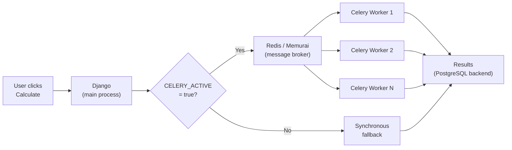

When a calculation triggers other calculations — say, a parent that kicks off five children — the framework can dispatch those children to [Celery](https://docs.celeryq.dev/) workers in parallel instead of processing them one by one. This is transparent to your code: you write the same `calculate()` method either way.

## Architecture



The key design principle: **Celery is optional**. If the broker is down or Celery isn't configured, the framework falls back to synchronous processing automatically. Your calculations still run — just sequentially instead of in parallel.

## Prerequisites: Redis (or Memurai on Windows)

Celery needs a message broker to dispatch tasks. Lex App uses **Redis** by default.

> [!info]- Linux / macOS — Install Redis
> ```bash
> # Ubuntu / Debian
> sudo apt install redis-server
> sudo systemctl enable --now redis
>
> # macOS (Homebrew)
> brew install redis
> brew services start redis
> ```
> Verify with `redis-cli ping` — you should get `PONG`.

> [!info]- Windows — Install Memurai
> Redis doesn't run natively on Windows. Use [Memurai](https://www.memurai.com/get-memurai) instead — a Windows-native, Redis-compatible in-memory datastore.
>
> 1. Download the **Developer Edition** (free, intended for development and testing) from [memurai.com/get-memurai](https://www.memurai.com/get-memurai)
> 2. Run the installer — Memurai starts automatically as a Windows service
> 3. Verify with `memurai-cli ping` — you should get `PONG`
>
> Memurai is fully compatible with the Redis API, so no code changes are needed. It listens on the same default port (`6379`).
>
> **Limitations of the Developer Edition:** restarts required every 10 days, max 10 connected hosts, 50% RAM cap. For production on Windows, use the [Enterprise Edition](https://www.memurai.com/get-memurai).

By default, the framework connects to `redis://127.0.0.1:6379/1` for local development (both Linux/macOS Redis and Windows Memurai).

## How It Works

### The `@lex_shared_task` Decorator

You can decorate a `calculate()` method with `@lex_shared_task`:

```python
from lex.lex_app.celery_tasks import lex_shared_task

class HeavyReport(CalculationModel):
    @lex_shared_task
    def calculate(self):
        # Your calculation logic — same as always
        ...
```

`@lex_shared_task` wraps your method into an enhanced Celery task with:

- **Context-aware dispatch** — respects `WaitForTasks` and `FireAndForget` context managers
- **Automatic status callbacks** — the task lifecycle updates `is_calculated` to the right terminal state on completion
- **Context propagation** — calculation IDs and audit logging context are forwarded to workers, including the active child model during batch dispatch

For root `CalculationModel` runs, the decorator is now optional. If `CELERY_ACTIVE=true` and Celery is reachable, the framework dispatches the calculation to a worker either way. Decorated methods are sent directly; undecorated ones are wrapped automatically.

### The Dispatch Flow

When a user clicks **Calculate ▶️**, the framework decides whether to use Celery or keep the work in-process:

1. Is `CELERY_ACTIVE=true` set in the environment?
2. Is Celery available and the broker reachable?

If **both** are true, the calculation is dispatched to a Celery worker — decorated methods (`@lex_shared_task`) go directly, undecorated ones are wrapped for you. Otherwise, it runs in-process on the app server. In both cases, the record moves to `IN_PROGRESS` right away so the frontend can keep showing progress while the calculation finishes.

For batch calculations (a parent triggering children), the framework uses `CeleryTaskDispatcher` to:

1. **Group** the child models into batches (clustered by calculation order)
2. **Dispatch** each group as a separate `calc_and_save` Celery task inside a `WaitForTasks` context
3. **Monitor** task completion (blocks until all groups finish)
4. **Retry** failed groups synchronously as a fallback

```python
# You don't call any of this directly.
# The framework handles dispatch when your calculate() triggers children.

class ParentCalculation(CalculationModel):
    @lex_shared_task
    def calculate(self):
        children = ChildCalculation.objects.filter(quarter=self.quarter)
        for child in children:
            child.is_calculated = "IN_PROGRESS"
            child.save()  # Triggers child calculation → dispatched to Celery
```

#### Nested fan-out runs in parallel too

The same rule applies when a calculation is **already running inside a worker** and triggers further work of its own. That nested fan-out is dispatched across the worker pool by default — it does *not* collapse onto the single slot the parent occupies. The parent still blocks until its children finish: if you've wrapped the work in a `WaitForTasks` context the framework reuses it, and if not it opens one for you and waits. This worker-in-worker wait path is now handled safely, so nested fan-out no longer trips Celery's "Never call result.get() within a task!" guard and drops back to a full synchronous rerun.

This matters for large combinatorial calculations. A parent that expands into, say, 50 clusters over tens of thousands of rows spreads those clusters across every available worker instead of grinding through them one at a time on a single slot. You don't have to opt in — write the same `calculate()` and the children parallelise on their own.

## Environment Variables

| Variable | Where to Set | Purpose |
|---|---|---|
| `CELERY_ACTIVE=true` | `.env` file (main app **and** workers) | Enables the Celery dispatch path. Without this, calculations stay in-process in the app. |
| `IS_RUNNING_IN_CELERY=true` | Worker command only | Tells the framework the process is a Celery worker (skips app startup tasks like data loading). **Do not** set this in the main app's `.env`. |
| `CELERY_BEAT_SCHEDULER` | `.env` or deployment config | Override the Beat scheduler class. Defaults to `django_celery_beat.schedulers:DatabaseScheduler` (reads the periodic-task schedule from the database). You can set it to `celery.beat:PersistentScheduler` for local dev if you don't need the DB-backed schedule. |
| `LEX_TASK_RECOVERY_ENABLED=true` | `.env` or deployment config | Enables the worker-recovery system (heartbeat, dead-worker detection, and automatic task requeue). Turn this on in deployments where you also run `lex-recovery-supervisor` or `lex-recovery-beat`. Default: `false`. |
| `LEX_TASK_HEARTBEAT_INTERVAL` | Deployment config | How often (in seconds) a running task emits a heartbeat to signal it is alive. Default: `5`. |
| `LEX_TASK_HB_TTL_MULTIPLIER` | Deployment config | A task is considered dead after `HEARTBEAT_INTERVAL × TTL_MULTIPLIER` seconds without a heartbeat. Default: `3` (15 s at the default interval). |
| `LEX_TASK_SUPERVISOR_SCAN_INTERVAL` | Deployment config | How often (in seconds) the supervisor sweeps for dead workers and requeues their tasks. Default: `10`. |
| `LEX_TASK_MAX_RETRIES` | Deployment config | Maximum number of times a task is automatically requeued after a dead-worker event. Once the budget is exhausted, the task is marked as failed. Default: `4`. |
| `LEX_WORKER_IDLE_SHUTDOWN_ENABLED` | Deployment config | Master switch for **all** worker self-termination — the idle watchdog, the cancel fast-path, and the post-task warm shutdown (see **Worker Shutdown & Recovery** below). Only takes effect in a non-local `DEPLOYMENT_TARGET` — local dev and CI are unaffected. Set to `false` for long-lived `-B`/recovery-beat workers. Default: `true`. |
| `LEX_WORKER_IDLE_SHUTDOWN_SECONDS` | Deployment config | How long (in seconds) a worker may sit with no work before the idle watchdog shuts it down. Default: `30`. |
| `LEX_CLUSTER_CANCEL_ENABLED` | Deployment config | Whether cancelling a calculation cascades to descendant tasks running on other worker pods via the Redis cancel index (see **Cancelling a Running Calculation**). Inert when `CELERY_ACTIVE` is off or no Redis is reachable. Default: `true`. |
| `LEX_CLUSTER_CANCEL_TREE_TTL_SECONDS` | Deployment config | TTL (seconds) for the Redis cancel-index tree that maps a calculation to its descendant task IDs. Default: `14400` (4 h). |
| `LEX_CLUSTER_CANCEL_MARKER_TTL_SECONDS` | Deployment config | TTL (seconds) for the cooperative cancel marker a task checks to self-abort. Default: `3600` (1 h). |

Add `CELERY_ACTIVE=true` to your project's `.env` file so it's always active when you run the app (from the terminal or PyCharm):

```env
CELERY_ACTIVE=true
```

## Running Workers

Start Celery workers in a **separate terminal** alongside your running app:

> [!info]- Linux / macOS
> ```bash
> IS_RUNNING_IN_CELERY=true CELERY_ACTIVE=true lex celery -A lex_app worker \
>   --loglevel=info \
>   --concurrency=12 \
>   --prefetch-multiplier=1 \
>   -n worker1@%h
> ```
>
> | Flag | Meaning |
> |---|---|
> | `--concurrency=12` | Number of parallel worker threads/processes |
> | `--prefetch-multiplier=1` | Don't prefetch extra tasks — important for long-running calculations |
> | `-n worker1@%h` | Worker name (`%h` expands to hostname). Use `worker2@%h`, `worker3@%h`, etc. for additional workers |
>
> You can run multiple worker processes on the same machine by changing the `-n` name.

> [!note]
> On **Windows**, Celery's default prefork pool isn't supported. Use the `--pool=solo` or `--pool=threads` flag, or run workers via [WSL](https://learn.microsoft.com/en-us/windows/wsl/).

For development, you can skip running workers entirely — calculations stay in-process by default when `CELERY_ACTIVE` is not set or `false`.

## Worker Shutdown & Recovery

### Auto-shutdown after task completion

In deployed (non-local) environments, a worker automatically requests a warm shutdown after finishing a task — but only if it has no other active or reserved work at that moment. This keeps the worker pool lean without risking premature shutdown when multiple tasks are queued on the same worker.

The check is safe under any `--concurrency` and `--prefetch-multiplier` combination.

This post-task shutdown obeys the same `LEX_WORKER_IDLE_SHUTDOWN_ENABLED` master switch as the idle watchdog below. Setting it to `false` keeps the worker alive after it finishes a task — which is exactly what a long-lived worker that also runs an embedded scheduler (a `-B` / recovery-beat process) needs, so it doesn't terminate itself after its first sweep.

### Idle self-termination

In deployed environments where workers run as autoscaled pods (e.g. KEDA ScaledJobs), the framework actively shuts an idle worker down so its pod can scale to zero. Two triggers drive this:

- An **idle watchdog** reaps a worker that has been sitting with no work for `LEX_WORKER_IDLE_SHUTDOWN_SECONDS` (default 30 s) — including a worker that started but never picked up a task.
- A **cancel fast-path** terminates a worker as soon as its only task is revoked, so a cancelled calculation doesn't leave a pod lingering.

Both triggers are gated behind a non-local `DEPLOYMENT_TARGET`, so local development and CI are never affected regardless of the settings. `LEX_WORKER_IDLE_SHUTDOWN_ENABLED=false` is the master switch that turns off **all** self-termination paths — the idle watchdog, the cancel fast-path, *and* the post-task warm shutdown above.

> [!tip] Long-lived workers with an embedded scheduler
> If you run a worker with `-B` (an embedded Beat scheduler) or the recovery-beat process, set `LEX_WORKER_IDLE_SHUTDOWN_ENABLED=false` for it. Otherwise it would request a warm shutdown after its first task and crash-loop — defeating the point of keeping a single always-on process around to drive the schedule.

### Task recovery

The framework includes a background recovery system that monitors running tasks via heartbeats and requeues work from workers that have died unexpectedly.

- Every running task emits a periodic heartbeat (every `LEX_TASK_HEARTBEAT_INTERVAL` seconds, default 5 s).
- A supervisor sweep runs every `LEX_TASK_SUPERVISOR_SCAN_INTERVAL` seconds (default 10 s) and looks for tasks whose heartbeat has gone stale.
- A stale task is automatically requeued, up to `LEX_TASK_MAX_RETRIES` times (default 4). If the budget is exhausted the task is marked as failed so the caller's result is not left hanging.

Recovery is **off by default**. Turn it on with `LEX_TASK_RECOVERY_ENABLED=true` only in environments where you also run a recovery driver (`lex-recovery-supervisor` or `lex-recovery-beat`). In local development and CI, you usually leave it off.

When a callback or recovery sweep moves a calculation to a terminal status, that change is recorded in history like any other, including the recovery reason.

#### Running the recovery driver

In a multi-worker deployment the sweep runs in its own process alongside your normal workers. Two standalone console scripts are available (note: these are separate executables, not `lex` subcommands):

- `lex-recovery-supervisor` — runs the sweep in a dedicated always-on loop.
- `lex-recovery-beat` — runs a lightweight Celery worker with an embedded scheduler, so the sweep schedule is **visible in the Django admin** instead of baked into the process.

```bash
IS_RUNNING_IN_CELERY=true CELERY_ACTIVE=true lex-recovery-beat
```

Either driver listens on a dedicated `recovery` queue, so the periodic sweep never inflates the main work queue your autoscaler watches. When it finds stranded work it re-queues that work onto the **normal** queue — so your standard workers do the actual recalculation, and the recovery process only detects and re-dispatches. Keep your regular workers running as usual.

## Cancelling a Running Calculation

If a calculation is running on a Celery worker, the UI/API can cancel it immediately. The framework revokes the running task, marks the record as `CANCELLED`, and also stops any active child calculations that belong to the same calculation tree.

This cascade works **across worker pods**. When a batch calculation fans out into many tasks spread over several workers, each task registers its ID in a shared Redis cancel index. Cancelling the parent discovers every descendant task in that index and revokes it — you don't have to chase down individual workers. Alongside the revoke, the framework sets a cooperative cancel marker, so a task that hasn't started yet (or is sitting between two models in a batch) sees the marker and self-aborts rather than waiting to be force-killed.

The cascade is inert whenever `CELERY_ACTIVE` is off or no Redis is reachable, and can be turned off with `LEX_CLUSTER_CANCEL_ENABLED=false`.

If the calculation is running synchronously in the web process, there's nothing to revoke, so instant cancel isn't available on that path.

## `WaitForTasks` and `FireAndForget`

The framework provides two context managers for advanced dispatch control. You typically don't need these — the framework uses them internally — but they're available for custom task orchestration.

> **Legacy names:** `RunInCelery`, `AwaitDispatch` and `UnblockCelery` still work as aliases for `WaitForTasks`/`FireAndForget`. They have no removal date set, but new code should prefer the canonical names — you'll get a deprecation warning before they're removed.

### `WaitForTasks`

Dispatches `@lex_shared_task`-decorated calls to Celery workers and **blocks on exit** until every dispatched task has finished. Without this context, tasks run synchronously in the current thread.

```python
from lex.lex_app.celery_tasks import WaitForTasks

with WaitForTasks():
    my_task(data)       # dispatched to a Celery worker
    other_task(data)    # dispatched to a Celery worker (runs in parallel)

# Execution reaches here only after BOTH tasks have completed
```

#### Selective dispatch

You can control which tasks get dispatched and which stay synchronous:

```python
# Only dispatch calc_and_save — everything else runs synchronously
with WaitForTasks(include_tasks={"calc_and_save"}):
    ...

# Dispatch everything EXCEPT initial_data_upload
with WaitForTasks(exclude_tasks={"initial_data_upload"}):
    ...
```

#### Nesting

`WaitForTasks` blocks can be nested. Each scope independently tracks and waits for only the tasks dispatched within it:

```python
with WaitForTasks():                    # outer scope
    compute_portfolio.delay(fund_a)     # dispatched, tracked by outer
    compute_portfolio.delay(fund_b)     # dispatched, tracked by outer

    with WaitForTasks():                # inner scope
        compute_nav.delay(q1)           # dispatched, tracked by inner
        compute_nav.delay(q2)           # dispatched, tracked by inner
    # ← blocks here until q1 and q2 finish

    generate_report.delay(fund_a)       # dispatched, tracked by outer

# ← blocks here until fund_a, fund_b, and the report finish
```

All four portfolio/NAV tasks run in parallel on Celery workers, but the calling thread waits at each scope boundary for the tasks it owns.

### `FireAndForget`

Dispatches tasks to Celery **without waiting** for them. Use this for side-effects that don't affect the caller's correctness — notifications, cache warming, analytics, etc.

On its own, `FireAndForget` simply dispatches and moves on:

```python
from lex.lex_app.celery_tasks import FireAndForget

with FireAndForget():
    send_report_email(report)       # dispatched, nobody waits
    notify_slack_channel(report)    # dispatched, nobody waits

# Execution continues immediately — emails may still be sending
```

When nested inside a `WaitForTasks` block, it **overrides** the blocking behaviour for specific calls:

```python
from lex.lex_app.celery_tasks import WaitForTasks, FireAndForget

with WaitForTasks():
    compute_nav.delay(q1)               # dispatched, parent WILL wait

    with FireAndForget():
        send_report_email(report)       # dispatched, parent WON'T wait
        notify_slack_channel(report)    # dispatched, parent WON'T wait

    compute_nav.delay(q2)               # dispatched, parent WILL wait

# Blocks until q1 and q2 finish. Emails/Slack may still be in flight.
```

#### When to use `FireAndForget`

| Use case | Why fire-and-forget |
|---|---|
| Email / Slack / webhook notifications | Caller doesn't need the result |
| Audit-log enrichment (async) | Nice-to-have, not on the critical path |
| Cache warming / precomputation | Optimisation, not required for correctness |
| Analytics / telemetry events | Tracking shouldn't slow calculations |

The key question: *"If this task fails or is delayed, does the caller break?"* If **no** → `FireAndForget`. If **yes** → let `WaitForTasks` handle it.

### Priority hierarchy

When contexts are nested, the **innermost** matching context wins:

| Priority | Context | Behaviour |
|---|---|---|
| 1 (highest) | `FireAndForget` | Dispatch to Celery, don't wait |
| 2 | `WaitForTasks` | Dispatch to Celery, block on exit |
| 3 (default) | No context | Run synchronously in-process |

## Failure Handling

The dispatcher handles failures at multiple levels:

| Failure Type | What Happens |
|---|---|
| **Celery import fails** | Entire batch runs synchronously |
| **Single task dispatch fails** | That group runs synchronously, others continue on Celery |
| **Task execution fails** | Failed group retried synchronously |
| **Broker goes down mid-run** | Remaining groups run synchronously |

This means your calculations are resilient — they always complete, even if the infrastructure has issues.

## When to Use Celery

| Scenario | Celery Useful? |
|---|---|
| Single calculation, no children | No — no parallelism to gain |
| Parent triggers 2–3 children | Maybe — overhead may not be worth it |
| Parent triggers 10+ children | Yes — significant speedup |
| Long-running calculations (minutes+) | Yes — prevents blocking the web process |
| Development / small projects | No — synchronous is simpler |

## Monitoring

Celery tasks are logged with full context:

```
Starting Celery dispatch for 5 groups containing 23 total models
Dispatch summary: 5/5 groups dispatched to Celery
Task processing completed: 5/5 tasks successful
```

You can also monitor Celery with [Flower](https://flower.readthedocs.io/):

```bash
lex celery -A lex_app flower
```

This gives you a web dashboard at `http://localhost:5555` with real-time task monitoring.
