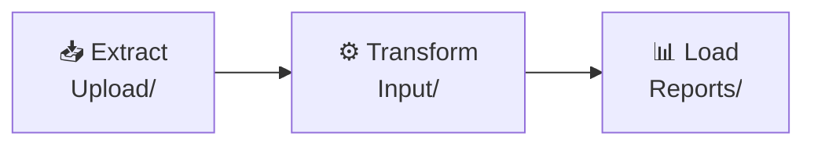

Lex App is an [open-source](https://github.com/ExcellenceCloudGmbH/lex-app) [Python](https://www.python.org/)/[Django](https://docs.djangoproject.com/) framework for building data-driven business applications. You write the models and the business logic. You get a web interface, a REST API, authentication, real-time updates, permissions and a complete audit trail without writing any of them.

## Start here

**Building an application?** Go to [[start-here/index|Start Here]] — install it, learn the folder layout, then build a real one in the [[start-here/tutorial/index|TeamBudget tutorial]]. Allow an afternoon.

**Using an application someone built for you?** Go to [[using-the-app/index|Using the App]]. Nothing there assumes you write Python.

**Moving a project off `generic_app`?** Start at [[migrating-from-v1/index|Migrating from V1]].

## How a Lex app is shaped

Every project follows Extract → Transform → Load, and the folder layout says so out loud:



| Stage | Folder | What lives here |
|---|---|---|
| **Extract** | `Upload/` | Models that ingest CSVs, Excel sheets and API payloads |
| **Transform** | `Input/` | Your business entities and the domain logic over them |
| **Load** | `Reports/` | Models that compute summaries and feed [Streamlit](https://docs.streamlit.io/) dashboards |

You meet this layout in [[start-here/project structure|Project Structure]] and use it for the rest of the tutorial.

## What the framework gives you

Each section is something you will need at some point, in roughly the order you tend to need it. None of it is mandatory — you use what your application actually calls for.

| Section | What it covers |
|---|---|
| [[model-your-data/index\|Model your data]] | Model structure, serializers, initial data, lifecycle hooks |
| [[calculations/index\|Calculations]] | Calculation models, batch generation, Celery, scheduling, logging |
| [[history-and-audit/index\|History & audit]] | Change history, bitemporal queries, audit logs |
| [[access-and-dashboards/index\|Access & dashboards]] | Permissions, Streamlit dashboards, widgets, embedding |
| [[ship-and-operate/index\|Ship & operate]] | Deploying, configuration, upgrading, monitoring, troubleshooting |
| [[using-the-app/index\|Using the app]] | The grid, record pages, saved views, exports — for the people who use what you built |
| [[reference/index\|Reference]] | CLI commands, environment variables, class internals |

## Quick start

```bash
pip install lex-app

lex setup     # generate .run/, .vscode/launch.json, .env and migrations/
lex init      # apply migrations, sync models and permissions to Keycloak
lex start --reload --loop asyncio lex_app.asgi:application
```

Full walkthrough in [[start-here/installation|Installation]].

> [!tip] `lex --help` does not list everything
> It shows the ten commands the CLI implements itself. Django management
> commands — `init`, `migrate`, `create_db`, `sync_keycloak` and the rest —
> all work, but stay hidden, because listing them would mean starting Django
> just to print help. [[reference/CLI Commands|CLI Commands]] is the complete
> list.
