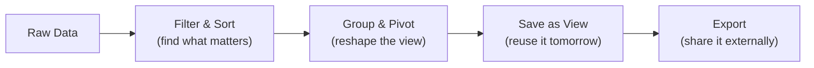

The grid is where you'll spend most of your time. It's an enterprise-grade datagrid powered by [AG Grid](https://www.ag-grid.com/) — think Excel, but connected to your live data, with real-time collaboration, and none of the versioning chaos.

Every model in your project gets a grid automatically. Open a model, and you'll see your data laid out in rows and columns with a full toolbar of capabilities above it.

If the same model is open in another tab or window, ordinary record changes show up automatically. Create, edit, or delete a row elsewhere — including bulk edits and deletes — and open lists refresh on their own once the change is committed, without a manual reload.

## What You Can Do

### [[interface/the-grid/filtering and sorting|Filtering & Sorting]]
Start broad, then narrow down. Column-level filters for text, numbers, dates, and foreign keys let you isolate exactly what matters. Multi-column sorting arranges data in the order that makes sense for your analysis.

### [[interface/the-grid/grouping and pivoting|Grouping & Pivoting]]
Reshape your data without changing it. Group rows by any column to create collapsible hierarchies. Turn on pivot mode for cross-tabulation — expenses by team per quarter, for example — with automatic aggregation.

### [[interface/the-grid/saved views|Saved Views]]
Once you've set up the perfect combination of filters, sorting, grouping, and column layout, save it. Switch between multiple views instantly — your "Q1 Travel Expenses" view or the "Manager Summary" view — without rebuilding each time.

### [[interface/the-grid/table settings|Table Settings]]

Tune the table to how you work — row density, pinned columns, and how numbers are
formatted. Saved for you, on that table.

### [[interface/the-grid/density and display|Density & Display]]
Adjust how tightly data is packed. **Compact** shows maximum rows for scanning large datasets. **Comfortable** gives each row breathing room for detailed review. Choose what fits your task.

### [[interface/the-grid/exporting data|Exporting Data]]
Take your data out of Lex App when you need to. Export respects your current view — filters, grouping, pivot state, and selected rows are all preserved. What you see is what you get.

## The Toolbar

Above every grid is a toolbar that gives you quick access to key actions:

| Control | What It Does |
|---|---|
| **View Selector** | Switch between saved views or create new ones |
| **Settings** (gear) | Density, display and column options, and per-column number formats — see [[interface/the-grid/table settings\|Table Settings]] |
| **As-Of** | Time-travel to see data as it existed at any point in the past |
| **Export** | Download the current view as Excel or CSV |
| **Calculate** | Trigger calculations on selected records (for calculation models) |
| **Abort** | Stop an in-progress calculation — appears next to the spinner while a calculation is running |
| **Add Record** | Create a new entry inline or via form |

## Inline Editing

Double-click any editable cell to modify it directly in the grid. Changes are validated in real-time — if a [[features/data-pipeline/serializers|serializer]] rejects the value, you'll see the error immediately. No separate edit form needed for quick corrections.

The grid stays live: when a record changes — whether you edited it, a colleague did, or a calculation produced it — the open grid updates on its own, so you're always looking at current data without pressing **Refresh**.

Fields you don't have [[features/access-and-ui/permissions|permission]] to edit appear as read-only — the grid respects your access level down to individual cells.

Choice fields use a picker instead of free text, required fields are marked
before you submit, and numeric model fields are treated as numbers for editing
and filtering.

Those edits also refresh other open lists for the same model, so you don't need to ask teammates to reload before they see the updated row.

## Creating a Record

**Add Record** opens a panel over the list, on the same layout editing uses, so you keep
your place, your filters and your scroll position instead of navigating away and back.
The full-page create route still exists and is still reachable — deep links and links
from a failed create both point at it — so nothing that relied on it has changed.

> [!example]- 🎬 Video — Inline editing with live validation
> <video controls width="100%">
>   <source src="../../videos/grid-inline-editing.mp4" type="video/mp4">
> </video>
> Double-click a cell, edit a value, see an inline validation error, then correct it.
