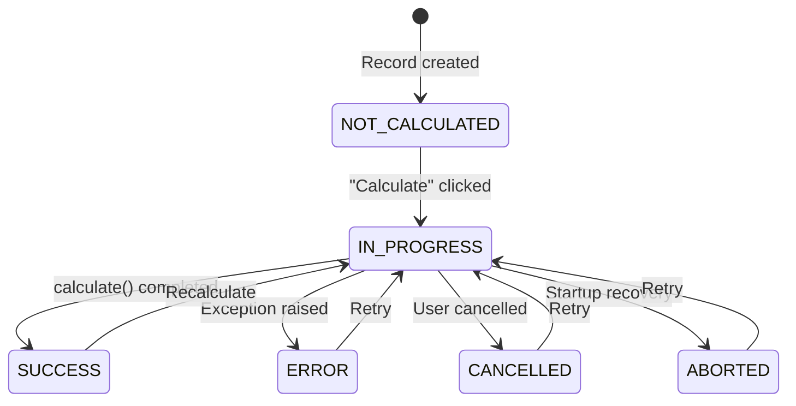

`CalculationModel` extends [[reference/LexModel Internals|LexModel]] with a built-in state machine and a `calculate()` hook. It's the base class for any model that performs on-demand computation — upload processing, report generation, data transformations, etc.

> [!tip]
> Browse the full source on [GitHub](https://github.com/ExcellenceCloudGmbH/lex-app/blob/lex-app-v2/lex/core/models/CalculationModel.py).

```python
from lex.core.models.CalculationModel import CalculationModel
```

## The State Machine

Every `CalculationModel` has an `is_calculated` field that transitions through six states:



| State | Constant | Meaning |
|---|---|---|
| `NOT_CALCULATED` | `CalculationModel.NOT_CALCULATED` | Default — record exists but hasn't been processed |
| `IN_PROGRESS` | `CalculationModel.IN_PROGRESS` | Calculation is running (triggers `calculate()` via lifecycle hook) |
| `SUCCESS` | `CalculationModel.SUCCESS` | Calculation completed without error |
| `ERROR` | `CalculationModel.ERROR` | An exception was raised — error details are stored on the record |
| `CANCELLED` | `CalculationModel.CANCELLED` | A user cancelled a running calculation |
| `ABORTED` | `CalculationModel.ABORTED` | The framework recovered a calculation that was left stuck in progress |

The `is_calculated` field is **not editable** in the UI — it's managed entirely by the framework. When a user clicks **Calculate ▶️** in the frontend, the framework sets `is_calculated = IN_PROGRESS`, which triggers the `calculate_hook`.

## `calculate()` Method

Override this method with your business logic. The framework handles everything else:

```python
class BudgetSummary(CalculationModel):
    team = models.ForeignKey(Team, on_delete=models.CASCADE)
    total_expenses = models.DecimalField(max_digits=12, decimal_places=2, default=0)

    def calculate(self):
        expenses = Expense.objects.filter(employee__team=self.team)
        self.total_expenses = expenses.aggregate(
            total=models.Sum("amount")
        )["total"] or 0
```

**What you don't need to write:**

| Concern | Handled By |
|---|---|
| `self.save()` | Framework saves automatically after `calculate()` returns (without bumping `edited_by` / `edited_at`) |
| Error handling | Framework catches exceptions and stores the error details on the record |
| State transitions | Lifecycle hooks manage the `IN_PROGRESS → terminal state` flow |
| Logging context | [[reference/LexLogger API|LexLogger]] automatically links to the current calculation |
| Concurrency | Runs inside `transaction.atomic()` by default |
| `edited_by` / `edited_at` on child saves | Any records you save inside `calculate()` are treated as system-triggered — their `edited_by` / `edited_at` are not stamped with the user who clicked Calculate |

> [!note]
> The legacy method name `update()` is also supported — if you override `update()` instead of `calculate()`, the framework will call it. We recommend using `calculate()` for new code.

## Atomic vs Non-Atomic

By default, `calculate()` runs inside a [Django](https://docs.djangoproject.com/) `transaction.atomic()` block — if anything fails, all database changes are rolled back. To opt out (for long-running calculations that should commit incrementally), set:

```python
class LargeImport(CalculationModel):
    is_atomic = False

    def calculate(self):
        # Commits happen as you go — no rollback on failure
        ...
```

## Celery Integration

In production, calculations can be dispatched to [Celery](https://docs.celeryq.dev/) workers for background/parallel processing. The framework checks two things automatically:

1. Is the `CELERY_ACTIVE` environment variable set to `true`?
2. Is Celery available and the broker reachable?

If both are true, the calculation is dispatched to a Celery worker — decorated methods are dispatched directly, undecorated methods are wrapped automatically. Otherwise, it runs in-process on the app server. Either way, the record is first saved in `IN_PROGRESS` and then updated again when the calculation finishes.

If you want the method itself to behave like a Celery task, decorate it with `@lex_shared_task`:

```python
from lex.lex_app.celery_tasks import lex_shared_task

class HeavyReport(CalculationModel):
    @lex_shared_task
    def calculate(self):
        ...
```

`@lex_shared_task` wraps your method with context-aware dispatch, automatic status callbacks, and audit logging context propagation to worker processes. For root `CalculationModel` runs, the decorator is optional — the framework will still dispatch to Celery when it's available.

> [!note]
> Set `CELERY_ACTIVE=true` in your project's `.env` file to enable Celery dispatch. You also need a running Redis instance (or [Memurai](https://www.memurai.com/get-memurai) on Windows) as the message broker.

See [[features/processing/celery and async calculations]] for the full setup guide — environment variables, running workers, and the `WaitForTasks` / `FireAndForget` context managers.

## Cancelling a Running Calculation

Use `CalculationModel.cancel(instance, recursive=True)` to stop an in-progress calculation that is currently running on Celery. The framework revokes the worker task, persists `CANCELLED`, and cancels active descendants in the same calculation tree as well.

For batch fan-outs whose tasks are spread across multiple worker pods, `cancel()` also consults a **Redis cluster cancel index**: each task registers its ID under the calculation's tree, so `cancel()` discovers and revokes descendant tasks it didn't directly dispatch. It additionally writes a cooperative cancel marker that an unstarted or between-models task checks and self-aborts on. This cascade is gated by `LEX_CLUSTER_CANCEL_ENABLED` and is inert without a reachable Redis.

If the record is not in progress — or it's running synchronously with no worker task to revoke — `cancel()` returns a report saying it wasn't cancellable instead of forcing the state change.

## Operator Recovery API

For triaging and recovering from calculations that are wedged in `IN_PROGRESS`, `CalculationModel` exposes three classmethods. They're the public surface behind an operator dashboard, CLI, or REST endpoint — each returns plain dicts/lists, never internal bookkeeping.

| Method | Returns | Use it to |
|---|---|---|
| `list_in_progress()` | List of active calculations, **sorted oldest-first**, each with `record_id`, `record`, `model_label`, `calculation_id`, `task_id`, `started_at` (UTC ISO-8601), `age_seconds`, and `cancellable` | See everything currently running |
| `find_stuck(older_than_seconds)` | Same shape, filtered to runs at least `older_than_seconds` old (inclusive; `0` returns all, negative raises `ValueError`) | Find runs that have overstayed a threshold |
| `cancel_stuck(older_than_seconds, *, reason="…")` | A report dict (`threshold_seconds`, `candidates`, `cancelled`, `skipped_not_cancellable`, `errors`, and a per-record `results` list) | Bulk-cancel everything older than the threshold |

`cancel_stuck()` reuses the per-record `cancel()` machinery, so each cancelled run gets the identical terminal state, audit row, and WebSocket broadcast as a single user-initiated cancel — there's no parallel recovery code path. Because `cancel()` is recursive, cancelling a parent also revokes descendants sharing its `calculation_id`; each parent appears only once in `results`. Synchronously-dispatched runs (no `task_id`) can't be revoked and are reported as `skipped_not_cancellable` rather than force-failed.

`started_at` is anchored to a monotonic clock internally, so `age_seconds` stays correct even if the system wall-clock jumps.

## Nested Calculations

When a parent calculation triggers a child, wrap the child execution in `model_logging_context` to preserve the log hierarchy:

```python
from lex.audit_logging.utils.ModelContext import model_logging_context

class ParentReport(CalculationModel):
    def calculate(self):
        child = ChildReport.objects.get(pk=self.child_id)
        with model_logging_context(child):
            child.is_calculated = "IN_PROGRESS"
            child.save()
```

## Batch Generation with CalculatedModelMixin

When you need to generate **many records** from dimensional combinations (e.g., one liability per award per upload), use `CalculatedModelMixin` instead. It provides a combination engine, duplicate handling, and parallel dispatch — see [[reference/CalculatedModelMixin Internals]] for the API reference and [[features/processing/batch calculations]] for the full guide.

## Inherited Features

Since `CalculationModel` extends `LexModel`, your calculation models also get:

- `created_by` / `edited_by` tracking
- `pre_validation()` / `post_validation()` hooks
- All `permission_*()` methods
- `streamlit_main()` / `streamlit_class_main()` for dashboards
- Full [[features/tracking/bitemporal history|bitemporal history]] (unless listed in `untracked_models`)

## Quick Reference

```python
from lex.core.models.CalculationModel import CalculationModel
from lex.audit_logging.handlers.LexLogger import LexLogger

class MyCalculation(CalculationModel):
    # Define your fields
    input_field = models.ForeignKey(...)
    result_field = models.DecimalField(...)

    def calculate(self):
        # 1. Query data
        # 2. Compute results
        # 3. Assign to self.result_field (framework saves)
        # 4. Log with LexLogger (optional)
        logger = LexLogger()
        logger.add_heading("Results")
        logger.add_text("Done!")
        logger.log()
```
